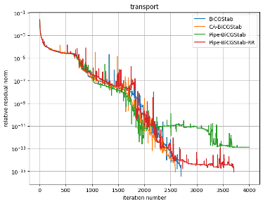
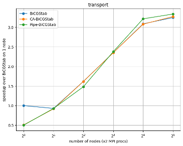
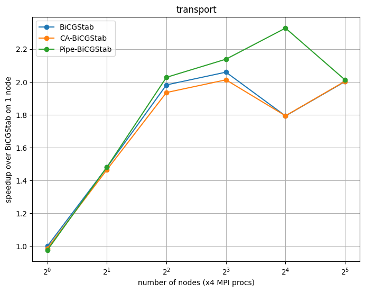

## 目次

1. [概要](#概要)
2. [srcフォルダの中身](#srcフォルダの中身)
3. [実験結果](#実験結果)
4. [最後に](#最後に)

## 概要

クリロフ部分空間法の1つである、BiCGStabのMPI実装を行いました。 
BiCGStabのアルゴリズムはCoolsらの論文 (https://doi.org/10.1016/j.parco.2017.04.005) を参考にしました。 
C言語で実装し、行列はmatrix market形式のファイルをCSR形式でメモリに格納しています。

## srcフォルダの中身

| ファイル名                | 処理内容                                                           | include |
| ------------------- | ----------------------------------------------------------------------- | ------------------------------------------------------------------------------------------ |
| mmio.c/mmio.h       | matrix market形式のデータを読み取る [Matrix Marketのページ](https://math.nist.gov/MatrixMarket/mmio-c.html)からダウンロードできる |   |
| vector.c/vector.h   | ベクトル演算                                                          |  |
| matrix.c/matrix.h   | 行列の構造体の定義、行列データのメモリへの格納、行列ベクトル積、その他行列操作  | mmio.h |
| solver.c/solver.h   | BiCGStabの関数  - BiCGStab   - Communication Avoiding BiCGStab   - Pipelined BiCGStab   - Pipelined BiCGStab with residual replacement  | vector.h, matrix.h |
| main.c              | 実行と時間計測                                     | solver.h |

## 実験結果

連立1次方程式における行列はTransport.mtx ([University of Florida](https://www.cise.ufl.edu/research/sparse/matrices/Janna/Transport.html))、右辺ベクトルは全ての要素が1のベクトルで実験を行いました。
 相対残差の収束履歴の取得と実行時間を計測しました。

| Matrix properties  |  |
| ------------------------- | ------------- |
| number of rows            | 1,602,111     |
| number of columns         | 1,602,111     |
| nonzeros                  | 23,487,281    |
| structural full rank?     | yes           |
| structural rank           | 1,602,111     |
| nonzero pattern symmetry  | symmetric     |
| numeric value symmetry    | 0%            |
| type                      | real          |
| structure                 | unsymmetric   |

### 相対残差の収束履歴

### 2プロセス/ノードでの1反復当たりの平均実行時間の比較

### 4プロセス/ノードでの1反復当たりの平均実行時間の比較

## 最後に

2プロセス/ノード、4プロセス/ノードである程度の台数効果を確認できました。 
1ノードあたりのプロセス数を4プロセスより増やすと、あまり台数効果を得られませんでした。行列ベクトル積で発生する通信がオーバーヘッドになっていると考えられます。

(<a href="#top">トップへ</a>)

